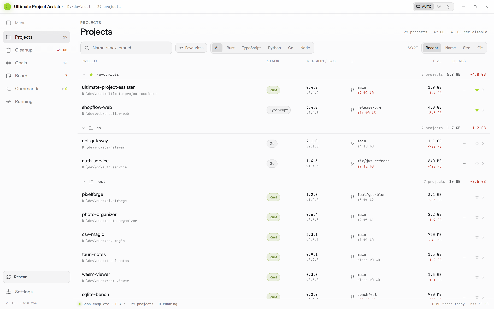
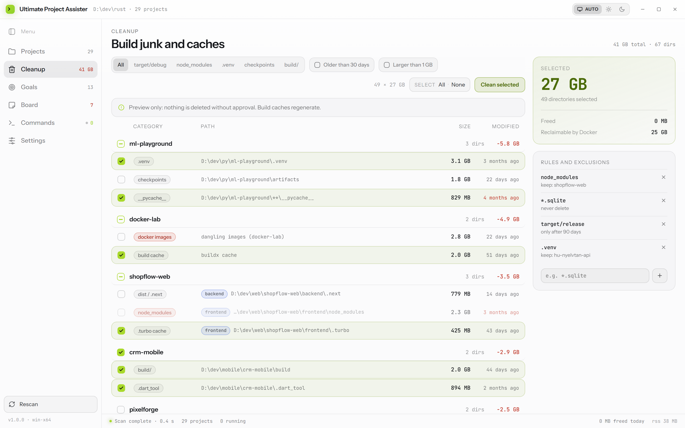
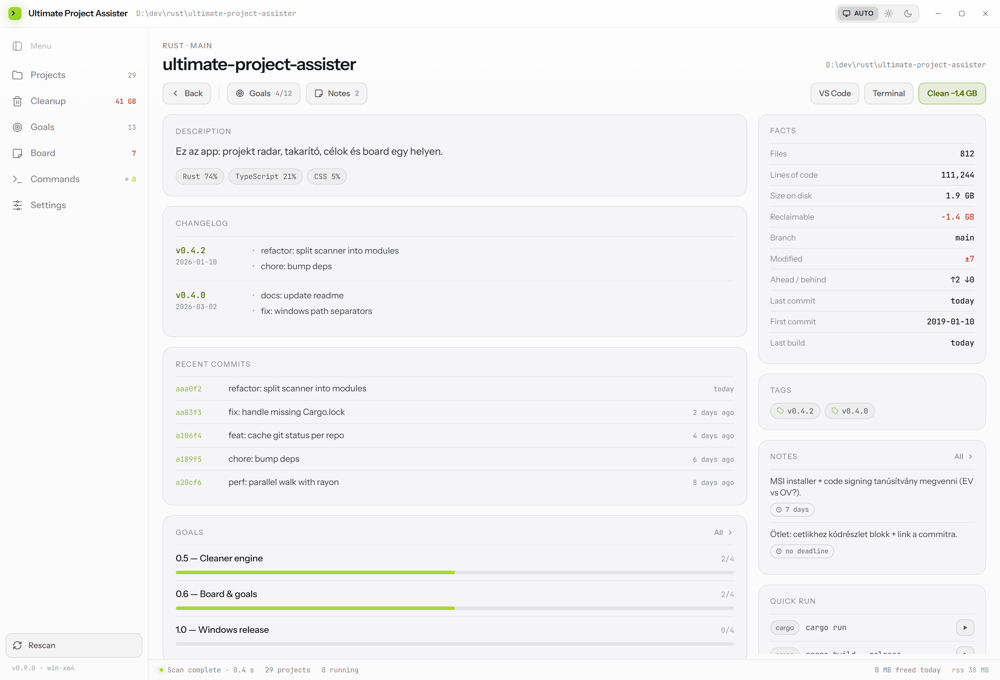
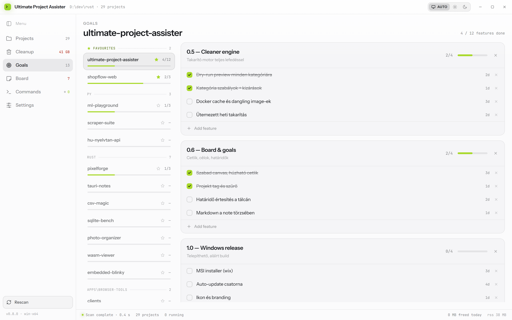
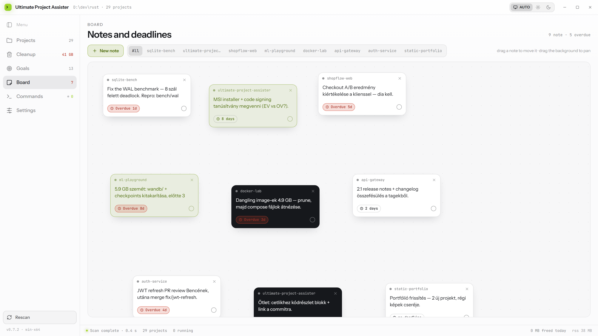
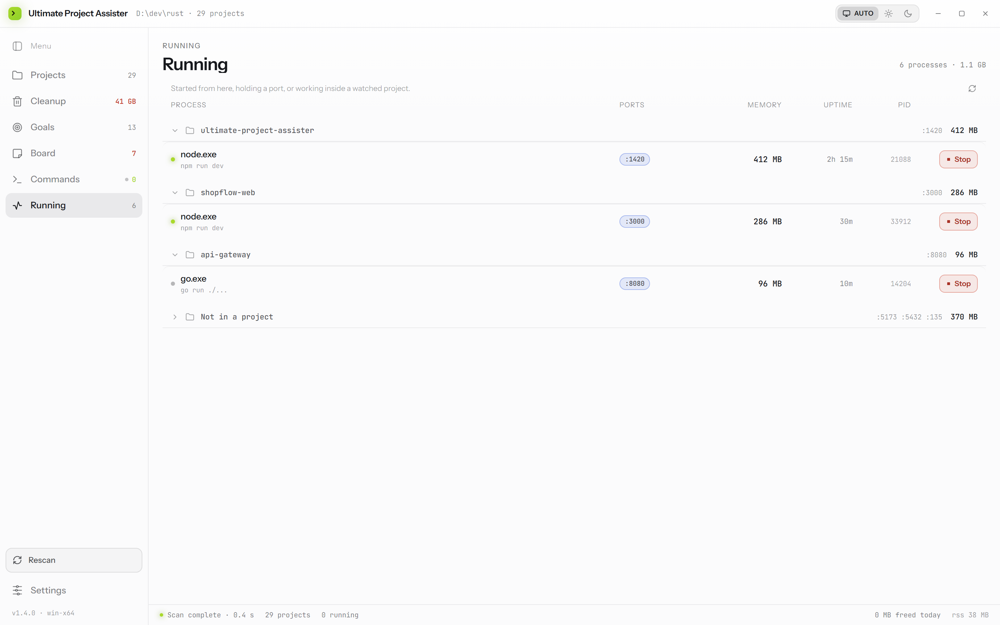
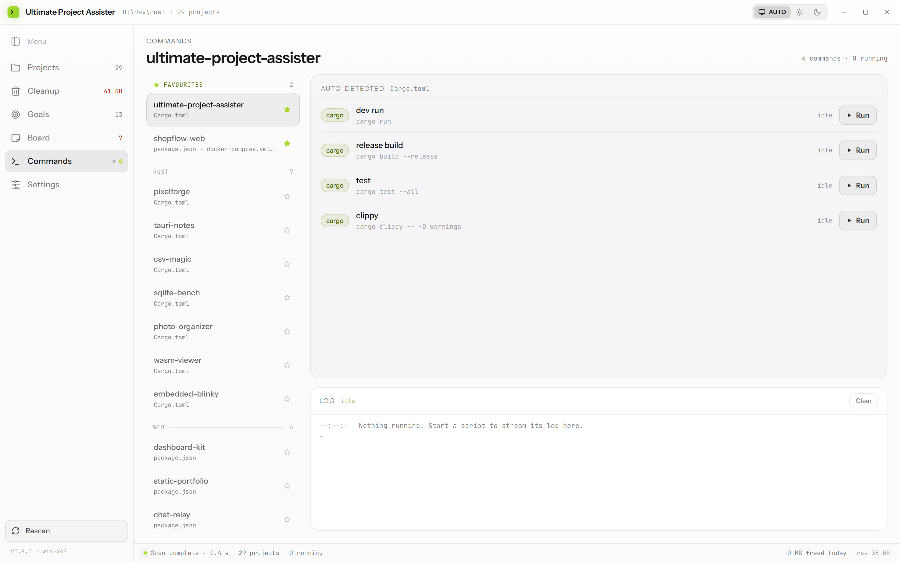
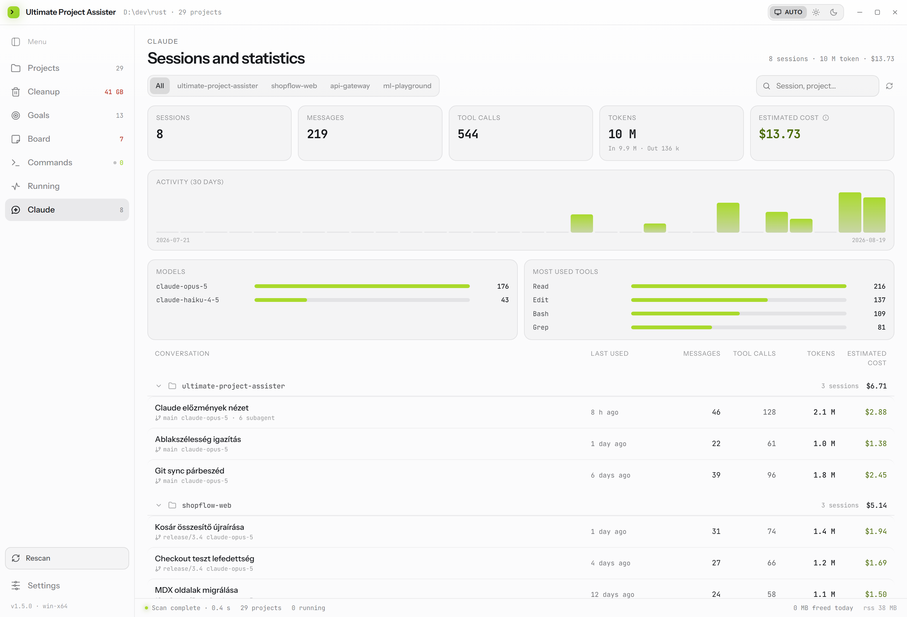

<div align="center">


# Ultimate Project Assister

**A desktop dashboard for a folder full of side projects.**

See what you have, find out what is eating the disk, keep track of what you
meant to finish, and run each project's own commands without leaving the window.

[](LICENSE)
[](CHANGELOG.md)
[](#install)

<sub>Rust (Tauri 2) backend · TypeScript + React frontend · builds on Windows,
macOS and Linux · interface in English and Hungarian, documentation English
only</sub>

</div>

---

<div align="center">



<sub>Every project in the watched folders, grouped by the directory that holds
them. Size on disk, reclaimable build junk, git state and goal progress, with
the pinned ones in a block of their own above the folders.</sub>

</div>

---

## What it does

| View | What actually happens |
| --- | --- |
| **Projects** | Grouped by the folder they live in. Walks your watched folders and recognises projects by their manifests (`Cargo.toml`, `package.json`, `pyproject.toml`, `go.mod`, `pubspec.yaml`, `composer.json`, `mix.exs`, `CMakeLists.txt`, compose files, `Makefile`). Reports size on disk, file and line counts, language breakdown and git state. A monorepo stays one row with several parts. |
| **Cleanup** | Measures build junk per category (`target/debug`, `node_modules`, `.venv`, `__pycache__`, `vendor`, `_build`, …) together with its age, grouped by project. Nothing is removed without confirmation, and the removal is guarded three ways. |
| **Goals** | Goals and features per project with progress bars. Stored as plain JSON. |
| **Board** | A free canvas of draggable notes with a project tag, a deadline and three colours. Opened from a project, new notes take that project; opened on its own, it asks which project a note belongs to. |
| **Commands** | Runnable commands read out of the manifests — every npm/pnpm/yarn/bun script, Makefile targets, cargo, compose — grouped by the file each came from. The ones that start, build or check a project lead their group; any command can be pinned. Every run gets its own log tab, and a port that is already taken is raised before the process starts rather than after it dies. |
| **Running** | What is actually running, under Commands: which project each process belongs to, the ports it holds, its memory and uptime, and a stop button. Not a task manager — a process earns a row by being started from here, listening on a port, or working inside a watched project. |
| **Claude** | Every Claude Code session held in these projects, read from the logs under `~/.claude/projects`: how many sessions and messages, what they spent in tokens, an estimated cost against published API rates, thirty days of activity, and which models and tools did the work. Sessions are grouped by the project they were run in, and any one of them opens as a readable transcript. |
| **Git sync** | Whether a project has fallen behind the branch it tracks, which only a fetch can answer — so there is one button that fetches every remote, and a badge on the projects that have moved. Opening one says who pushed what, and offers the single operation that fits: a fast-forward when nothing of yours is in the way, a rebase when both sides have moved. Uncommitted work is stashed and put back; a rebase that stops on a conflict says which files, and can be undone in one click. |
| **Requirements** | What each project needs installed — Node and the package manager its lockfile names, cargo, Python, Go, Docker, Make, and the rest — checked against PATH, with versions. Anything missing says which manifest asked for it, and offers the install command where the tool is packaged. |
| **Docker** | Whether the CLI is there, whether the daemon is answering, its version, containers and images, and the compose stack belonging to the open project. |
| **Settings** | Watched folders, scanning options, cleanup age threshold, checking remotes after a scan, desktop notifications, window anchoring, language. |

---

## Screenshots

Every list groups things that belong together. Projects, Goals and Commands
group by the folder the projects live in; Cleanup groups by project. Headings
carry the totals for the block, and disappear when there is only one of them.

Starring a project pins it to a **Favourites** block above the folders — in all
three lists, so a favourite is in the same place wherever you look. Every
heading folds, and one filter narrows all three lists to the pinned projects.
Both are remembered between sessions.

### Cleanup

Grouped by project, biggest first, with per-project totals and a tri-state group
checkbox. Category badges turn red for directories that regenerate on the next
build. The blue chips mark which package of a monorepo a directory belongs to.

Confirming a cleanup closes the dialog and the removal carries on behind it, so
the app stays usable while it works. Progress is reported in the status bar and
measured in bytes, not directories — a single three-gigabyte `node_modules` is
one directory but most of the wait. A notification says when it is done, and can
reach the desktop as well if that is switched on in Settings.



### Project detail

The whole `README.md` is rendered here, clamped to a few lines with the rest one
click away, and a `CHANGELOG.md` is shown per version the same way — five at a
time. The side column carries the facts, the requirements check, Docker when the
project uses it, tags, notes and quick run, all pinned while the page scrolls.



### Goals



### Board



### Running

Grouped by the project each process belongs to, with per-group ports and memory.
Anything belonging to no project is folded away by default. A process started
from here is stopped through the runner that owns it; anything else goes by PID,
and system processes are listed without a button at all.



### Commands



### Claude

Claude Code writes one log file per session next to the project it was run in.
This view reads them and reports what happened: sessions and messages, tokens
split between what went in and what came back, an activity strip for the last
thirty days, and the models and tools that did the work. A session opens as a
transcript — the prompts, the answers and the tools each turn reached for, with
long messages cut short.

The cost is an estimate against Anthropic's published API rates, so it is a
measure of size rather than an invoice: a subscription is not billed this way.
The logs are only ever read, never written, and a file is parsed once — a second
look only reads the lines that have been appended since.



---

## Install

Download an installer from the [releases](https://github.com/DanSketic/Ultimate-Project-Assister/releases),
or build from source.

### Build from source

Requirements: **Node 18+**, **Rust stable**, and on Windows the
[Microsoft C++ Build Tools](https://visualstudio.microsoft.com/visual-cpp-build-tools/)
plus WebView2 (already present on Windows 11).

```bash
npm install
npm run dev
```

To produce installers (`.msi` and `.exe` on Windows):

```bash
npm run build
```

The interface can also be run in a plain browser against a sample dataset, with
no Rust toolchain involved — useful for working on the UI:

```bash
npm run dev:vite
```

---

## How the window behaves

Two behaviours are deliberate and worth knowing about.

**The window sizes itself to the view.** Each view asks for the width it needs,
so the board is wide and the settings screen is narrow, and the rest of your
monitor stays free. **Settings → Fixed edge** decides which edge stays put while
that happens; the default is the left edge, so the window grows to the right.
The sidebar moves to whichever edge is anchored, so the menu never slides out
from under the pointer.

**It remembers where you left it.** Position, height and maximised state are
restored on the next launch. Width is remembered *per view*: widen the board and
it opens wide next time, while the projects list keeps its own width. If the
saved position lands on a monitor that is no longer attached, the window opens
centred and keeps only the size.

**It opens on last session's results.** The scan is cached, so the window shows
your projects immediately instead of an empty list, and the status bar says
`From last scan · 2 h ago` until the fresh scan replaces it. Projects whose
folder has since disappeared are dropped from the cache rather than shown as
ghosts.

---

## Monorepo support

A project is **one folder that may contain several packages**. Discovery stops at
a directory when it either

- contains a manifest, or
- is a git repository root (`.git`) — even with no manifest of its own, or
- declares a workspace (`pnpm-workspace.yaml`, `go.work`, `turbo.json`,
  `nx.json`, `lerna.json`, `rush.json`).

Inside that root it then looks for **parts**, up to three levels deep. So this is
a single project with two parts, not two unrelated projects:

```
shopflow/
├─ .git/
├─ frontend/   package.json   → TypeScript
└─ backend/    Cargo.toml     → Rust
```

What that buys you:

- **Size and junk are measured per part.** `frontend/node_modules` belongs to the
  frontend, `backend/target/debug` to the backend. The project's headline stack
  comes from whichever part holds the most source.
- **Commands run in their own directory.** `npm run dev` in the frontend and in
  the backend are two independent processes, because a running command is keyed
  by its working directory as well as its name.
- **Search and the stack filter match parts too**, so the project above shows up
  under both `TypeScript` and `Rust`.
- A **nested git repository** (a submodule, or a repo cloned inside another) is
  never treated as a part — it belongs to itself.

---

## Safety when deleting

`remove_dir_all` is the one irreversible thing this app does, so
`clean.rs::validate` demands three independent conditions before a directory is
removed:

1. the target resolves **inside** its project root (after canonicalisation),
2. it is not the project root itself,
3. its directory name appears in the `DELETABLE_NAMES` allowlist.

A bug in discovery therefore cannot turn into a deleted source tree.

Two further rules keep the numbers honest: a cleanup entry is never offered if it
**contains another entry** (which is why `target/debug/incremental` is folded
into `target/debug` rather than listed separately), and never if it would
swallow another part of a monorepo. What a row says it frees is what it frees.

Exclusion rules in the cleanup sidebar accept glob patterns and keep matching
directories out of the automatic selection. Scope a rule to a single project by
writing `keep: <project>` — you can always still tick the row by hand.

---

## Layout

```
src/                     TypeScript + React frontend
  api.ts                 typed bridge to Rust (falls back to sample data without Tauri)
  useApp.ts              the whole application state in one hook
  i18n.ts                English / Hungarian dictionary
  format.ts              size, date and rule formatting
  theme.css              design tokens, light and dark
  components/            title bar, sidebar, status bar, dialog, icons
  views/                 the seven views
src-tauri/               Rust backend
  scan.rs                project discovery, measurement, language stats
  git.rs                 branch, dirty state, tags and changelog via git2
  clean.rs               guarded deletion
  docker.rs              daemon state, counts, sizes and a project's containers
  tools.rs               which toolchains a project needs, and whether PATH has them
  ports.rs               the port a command will ask for, and whether it is free
  cmds.rs                runnable commands read from manifests
  runner.rs              process spawning, log streaming, process-tree kill
  watcher.rs             filesystem watching via notify
  geometry.rs            window position and size persistence
  store.rs               settings, goals and notes as JSON
  commands.rs            the IPC surface
scripts/gen-icons.mjs    icon generation (PNG + ICO, no external tooling)
```

### Where your data lives

`%APPDATA%\dev.upa.ultimate-project-assister\` on Windows, the equivalent config
directory elsewhere: `settings.json`, `goals.json`, `notes.json` and the scan
cache `projects.json`. Plain, hand-editable JSON — missing keys fall back to
defaults, a UTF-8 BOM is tolerated, and a corrupt file makes the app fall back
to defaults rather than crash. Deleting `projects.json` costs nothing; the next
scan rebuilds it.

---

## Known limitations

- **Fonts** are loaded from Google Fonts (`Instrument Sans`, `JetBrains Mono`).
  On an offline machine the system fallback is used. To bundle them, drop the
  woff2 files into `public/` and replace the link in `index.html` with
  `@font-face` rules.
- **Docker** figures come from parsing the CLI's own output (`docker info`,
  `docker system df`, `docker ps`). With the daemon stopped the panel says so
  rather than disappearing, but it cannot report sizes until it is started.
- **Installing a toolchain** uses the platform's package manager — winget on
  Windows, Homebrew on macOS. On Linux the distributions differ too much for a
  single command to be trustworthy, so only the two npm-installed tools are
  offered and everything else points at its documentation. Composer, Elixir,
  Gradle and Maven are not in winget at all, and are handled the same way.
- **A tool is found by looking it up on PATH**, so something installed but not
  on PATH reads as missing — which is also what the project's own commands will
  find when they try to run.
- **The port a command will use is inferred**, from an explicit `--port`, a
  `.env`, a vite/nuxt/astro config, a compose file, or the framework's default.
  A project that picks its port some other way is not detected, and the warning
  simply does not appear. Whether the port is free is not inferred: it is
  decided by trying to bind it.
- **A port held by a process this app did not start cannot be freed from here.**
  Its holder is not named either — the PID behind a socket is not readable for
  another user's process, and a wrong name would be worse than none.
- **A fetch goes through the `git` command line**, not through libgit2, so it
  uses the credential helper, ssh agent and proxy settings you already have. It
  never waits on a terminal prompt: a remote that needs a credential no helper
  can supply fails and says so, rather than hanging. `behind` is only ever as
  fresh as the last fetch, which is why the dialog says when that was.

- **A rebase that stops on a conflict is not resolved here.** The files are
  listed and a terminal opens on the project, because resolving a conflict is
  an editor's job. Undoing the rebase is one button, and puts the branch back
  exactly where it was.

- **Filesystem watching is deliberately shallow** — the project root and its
  `.git` directory, not the whole tree — so that `node_modules` cannot drown the
  notify watcher.
- **Cleanup progress advances per directory**, not per byte. Removing a single
  3 GB `node_modules` holds the bar at one position while the path label shows
  what is being worked on.

---

## Contributing

See [CONTRIBUTING.md](CONTRIBUTING.md). Every change adds a
[CHANGELOG.md](CHANGELOG.md) entry.

## License

[MIT](LICENSE) © DanSketic
